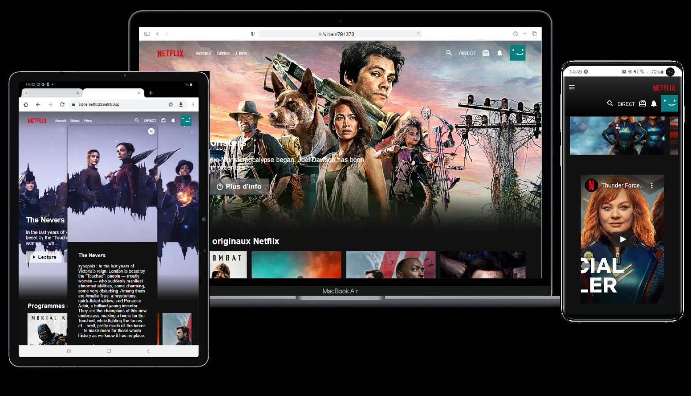

# Netflix Clone

extrait :(https://www.webmobilefirst.com/screencasts/yWQD-KbCP/) 

This is a front-end clone of Netflix that displays the trailers and is deployed using [Netlify](https://www.netlify.com/).

# Technolgies Used:

- [Visual Studio Code](https://code.visualstudio.com/)

- [Nodejs](https://nodejs.org/en/)

- [Reactjs](https://reactjs.org/)

- [React Youtube](https://www.npmjs.com/package/react-youtube)
- [Axios](https://www.npmjs.com/package/axios)

- [The Movie Database](https://www.themoviedb.org/)

# Deploy to Netlify:

# Bug:

Not all of the trailers diplay when you click on an image. I am still trying to resolve it and currently my research has advised this is current issue with the technology.

# Credits

- [Design made with the support of the chain], (https://www.youtube.com/channel/UCl-_gcFel_5pNT2pa90m0Nw)